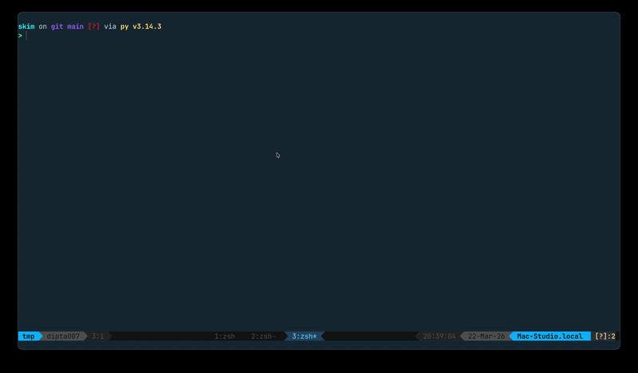

# skim

Generate plain-language narratives and technical summaries from arxiv papers.



## Three Ways to Use skim

| #   | Method                                                 | Best for                                                                          | API key needed? | Cached? |
| --- | ------------------------------------------------------ | --------------------------------------------------------------------------------- | --------------- | ------- |
| 1   | [**CLI + OpenAI**](#option-1-cli--openai)              | Regular use, any OpenAI-compatible API (OpenAI, OpenRouter, Ollama, local models) | Yes             | Yes     |
| 2   | [**CLI + Claude**](#option-2-cli--claude)              | Already have a Claude Code subscription, don't want another API key               | No              | Yes     |
| 3   | [**Claude Code Plugin**](#option-3-claude-code-plugin) | Already inside Claude Code, want one-command summaries                            | No              | No      |

---

### Option 1: CLI + OpenAI

Install once, use anywhere from your terminal. Works with any OpenAI-compatible API — OpenAI, OpenRouter, Ollama, or any local model server.

```bash
uv tool install git+https://github.com/dipta007/skim    # or pipx, or pip, see the Install section below
skim init                                               # select "openai", enter API key
skim -p 2509.16538 -t story                             # generate summary
```

### Option 2: CLI + Claude

Same CLI, but uses your existing Claude Code subscription — no API key needed. Requires the `claude` CLI to be installed and logged in.

```bash
uv tool install git+https://github.com/dipta007/skim    # or pipx, or pip, see the Install section below
skim init                                               # select "claude"
skim -p 2509.16538 -t story                             # generate summary
```

### Option 3: Claude Code Plugin

Already inside Claude Code? Install the plugin and use slash commands — no setup, no API key.

```
/plugin marketplace add dipta007/skim
```

```
/plugin install skim@dipta007-skim
```

Then, inside your claude-code:

```
/story 2509.16538
/deep 2509.16538
```

Claude reads the paper and generates the summary directly.

---

## Summary Types

| Type    | What you get                                                                    |
| ------- | ------------------------------------------------------------------------------- |
| `story` | A plain-language, analogy-driven narrative — no jargon, no equations            |
| `deep`  | A structured technical summary with methodology, results, and key contributions |

## Browser Viewer

Open summaries in the browser with proper LaTeX math rendering, dark/light theme toggle, and a readable serif font:

```bash
skim -p 2509.16538 -t deep --open
```

## Cache Management

Summaries are cached locally so repeated lookups are instant. To clear the cache:

```bash
skim clean                    # remove all cached summaries
skim clean -p 2509.16538      # remove cache for a specific paper
```

## Configuration

Config lives at `~/.config/skim/config.toml`. Re-run `skim init` to change settings.

<details>
<summary>Example configs</summary>

**OpenAI backend:**

```toml
[api]
backend = "openai"
key = "sk-your-key"
base_url = "https://api.openai.com/v1"
model = "gpt-5.4-nano"

[output]
dir = "~/papers/skim"
```

**Claude backend:**

```toml
[api]
backend = "claude"
key = ""
base_url = ""
model = "sonnet"

[output]
dir = "~/papers/skim"
```

</details>

## Install

**With uv (recommended):**

```bash
uv tool install git+https://github.com/dipta007/skim
```

**With pipx:**

```bash
pipx install git+https://github.com/dipta007/skim
```

**With pip:**

```bash
pip install git+https://github.com/dipta007/skim
```

**From source:**

```bash
git clone https://github.com/dipta007/skim.git
cd skim
make install
```

## Development

```bash
git clone https://github.com/dipta007/skim.git
cd skim
make install    # Install dependencies + set up git hooks
make test       # Run tests
make lint       # Check code style
make format     # Auto-format code
```

`make install` also configures git hooks that run the formatter/linter on commit and tests on push.

## Roadmap

- [ ] Support local PDF files (not just arxiv IDs)
- [ ] `skim list` — show all previously summarized papers
- [ ] `skim history` — recently read papers
- [ ] Export to PDF (from browser viewer / CLI flag when `--open` is not used)
- [ ] Custom prompt types — let users add their own `.md` prompts beyond story/deep (interactive)
- [ ] `skim search` — semantic search over local summaries or global database
- [ ] Global database with public summary gallery

## Related Projects

### Standalone Tools

- [autoresearch](https://github.com/karpathy/autoresearch) — Autonomous AI agent that iteratively modifies LLM training code, runs experiments, and discovers improvements overnight
- [ChatPaper](https://github.com/kaixindelele/ChatPaper) — ChatGPT-powered arxiv paper summarizer with translation, review generation, and polishing
- [paper-qa](https://github.com/Future-House/paper-qa) — RAG-based Q&A over collections of scientific PDFs with inline citations

### Claude Code Skills

- [research-junshi](https://github.com/junshi-research/research-junshi) — Tracks new arXiv papers daily and proposes ranked research directions tailored to your work
- [paper-craft-skills](https://github.com/zsyggg/paper-craft-skills) — Deep analysis, comic-style summaries, and quick overviews of papers
- [agent-research-skills](https://github.com/lingzhi227/agent-research-skills) — Systematic academic literature review
- [paper2code-skill](https://github.com/issol14/paper2code-skill) — Converts research papers into executable code

### Claude Code Plugins

- [research-tools](https://github.com/kdkyum/research-tools) — Read arXiv papers, generate research reports, and send to Telegram

### Claude Code Agents

- [claude-scholar](https://github.com/Galaxy-Dawn/claude-scholar) — Full research pipeline from ideation to publication with Zotero integration
- [claude-research](https://github.com/flonat/claude-research) — PhD researcher infrastructure with skills, agents, and hooks for academic workflows

### MCP Servers

- [arxiv-mcp-server](https://github.com/blazickjp/arxiv-mcp-server) — Search, download, and read arxiv papers from AI assistants
- [ZotLink](https://github.com/TonybotNi/ZotLink) — Zotero + arXiv preprint management with rich metadata and smart PDF attachments
- [arxiv-latex-mcp](https://github.com/takashiishida/arxiv-latex-mcp) — Fetches arXiv LaTeX sources for precise math expression interpretation
- [paper-fetcher](https://github.com/fermionoid/paper-fetcher) — Full-text paper fetcher with Open Access, arXiv, and EZproxy support

## Contributing

See [CONTRIBUTING.md](CONTRIBUTING.md) for development setup, code style, and PR guidelines.

<!-- ## Star History -->
<!---->
<!-- <a href="https://www.star-history.com/?repos=dipta007%2Fskim&type=date&legend=bottom-right"> -->
<!--  <picture> -->
<!--    <source media="(prefers-color-scheme: dark)" srcset="https://api.star-history.com/image?repos=dipta007/skim&type=date&theme=dark&legend=bottom-right" /> -->
<!--    <source media="(prefers-color-scheme: light)" srcset="https://api.star-history.com/image?repos=dipta007/skim&type=date&legend=bottom-right" /> -->
<!--     -->
<!--  </picture> -->
<!-- </a> -->
<!---->
<!-- ## License -->
<!---->
<!-- MIT -->
